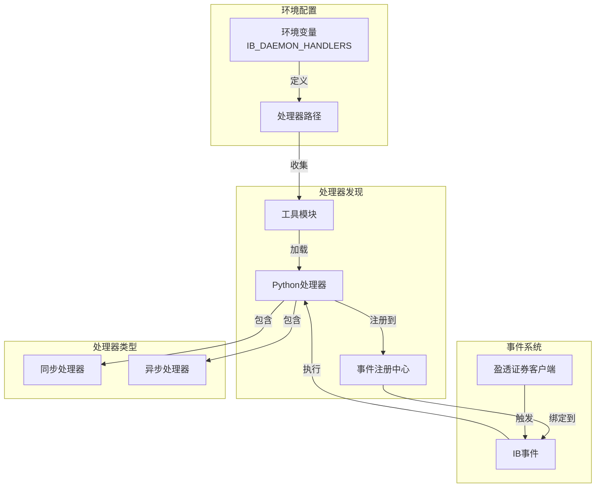

# Ibkr-event-daemon

### 概述

基于 ibevent 库的轻量级盈透证券(Interactive Brokers)事件处理工具。该项目自动化了 IBKR 交易平台的事件捕获、触发和分发过程。

### 安装

```bash
pip install ibkr_event_daemon
# 或者使用 poetry
poetry add ibkr_event_daemon
```

### 系统架构



### 事件处理系统

#### 核心组件

1. **环境配置**
   - 使用环境变量 `IB_DAEMON_HANDLERS` 指定处理器位置
   - 支持使用系统路径分隔符分隔的多个路径
   - 同时支持文件和目录路径配置

2. **处理器发现机制**
   - 自动发现指定路径中的 Python 文件
   - 递归搜索目录中的处理器
   - 自动过滤 `__init__.py` 和无效文件
   - 提供完善的错误处理机制

3. **事件注册中心**
   - 通过装饰器管理处理器注册
   - 支持同步和异步处理器
   - 维护处理器元数据和源信息
   - 提供日志记录和错误跟踪
   - **处理器可直接访问 IB 实例**
   - **支持实时行情数据处理**

4. **事件绑定**
   - 自动将处理器绑定到对应的 IB 事件
   - 处理异步/同步处理器类型转换
   - 实现错误处理和日志记录
   - 支持动态处理器配置

#### 使用示例

1. **配置处理器路径**
```bash
# Windows 系统
set IB_DAEMON_HANDLERS=C:\path\to\handlers;C:\another\path\to\handlers

# Linux/Mac 系统
export IB_DAEMON_HANDLERS=/path/to/handlers:/another/path/to/handlers
```

2. **创建事件处理器**
```python
from ibkr_event_daemon import IBEventRegistry

# 同步处理器 - 订单状态
@IBEventRegistry.collect('orderStatus')
def handle_order_status(ib, order: Dict[str, Any]) -> None:
    print(f"订单状态: {order.status}")
    # 可以直接通过 ib 实例进行操作
    ib.cancelOrder(order.orderId)

# 异步处理器 - 实时行情
@IBEventRegistry.collect('barUpdate', is_async=True)
async def handle_bar_update(ib, reqId: int, bar: Dict[str, Any]) -> None:
    print(f"实时行情: {bar}")
    # 可以发送新的请求
    await ib.reqRealTimeBars(reqId, "AAPL", "SMART", "TRADES", 5)
```

3. **初始化系统**
```python
from ibkr_event_daemon import initialize_ib

# 初始化 IB 客户端并自动发现处理器
ib = initialize_ib()
```

### 功能特性

- 基于环境变量的配置
- 自动处理器发现
- 支持同步和异步处理器
- 完整的日志系统
- 健壮的错误处理
- 动态处理器注册
- 灵活的路径配置

### 最佳实践

1. **处理器组织**
   - 将相关处理器分组到独立文件中
   - 使用清晰描述性的处理器命名
   - 包含适当的文档和类型提示

2. **错误处理**
   - 在处理器中实现适当的异常处理
   - 使用日志进行调试和监控
   - 妥善处理同步和异步错误

3. **性能优化**
   - 保持处理器轻量和专注
   - 对 I/O 操作使用异步处理器
   - 避免在事件处理器中进行重度处理

### 故障排除

常见问题及解决方案：

1. **处理器未找到**
   - 验证环境变量配置
   - 检查文件权限和路径
   - 确保正确的 Python 文件结构

2. **事件绑定失败**
   - 验证事件名称与 IB API 事件匹配
   - 检查处理器函数签名
   - 查看错误日志获取详细信息

3. **性能问题**
   - 监控处理器执行时间
   - 对长时间操作使用异步处理器
   - 实现适当的错误处理